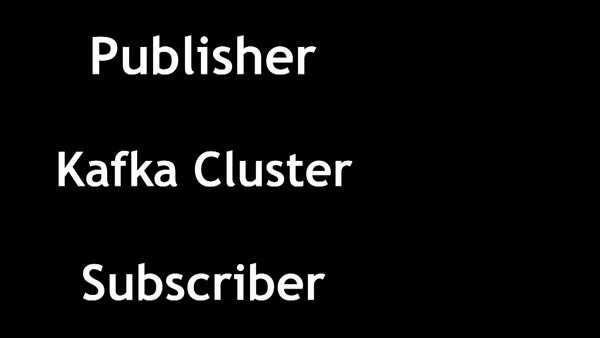

# Forex Cluster Streams

## This program uses Kafka with Zookeeper to take in currency pair data as a producer and ship to consumers

### Introduction

One of the major challenges of handling data in the financial world is the live nature of the market.  As traders of all markets are making decisions based on real time data, the processing that is performed on a cluster may necessitate this data to be retrieved at set intervals, whether daily, hourly, or even by the second if required.

The users of an app that deal with live data also need to visualize this data in real time.  Yahoo Finance is a great example of this, where the ticker shows a stock price that increases or decreases in real time accompanied by a respective green or red highlight to indicate price movement.


But how does this happen?  How does Yahoo manage to get these real time quotes and push it so quickly to their interface, so that the user can see it insantaneously?

This is where **streaming** comes in: the steady, high-speed, and continuous transfer of data.   
Tim Berglund of Confluent states that its best to think of streaming as an "unbounded, continuous real-time flow of records"¹,and this is a good visual representation of what we are viewing in real time.

******************
This application will transform the data as it comes in
First, we need a structure to operate upon
So we will use Kafka
What does this structure look like?
******************

Kafka is what is known as a **publish-subscribe** messaging system.

In this system, we have one or more servers running Kakfa.
These servers are known as Kafka brokers, and constitute our Kafka Cluster.

The publishers are responsible for pushing messages into our Kafka Cluster.  As an example, look at the stock trade gif above.  Imagine that as our producer, where every time the price gets updated, it pushes that input as a message into our Kafka Cluster.

On the other end, our subscribers consume the data as its produced.  Think of how the Yahoo Website is actually retrieving that information in the first place to display to our monitor.  It has an app that is subscribed to that data and utilizes it to display the resulting stock prices.



Now when we are pulling data from an API, we are usually pulling lots of different kinds of data.  We don't want all of this data to be pushed into our cluster, because our subscriber is only looking for very specific information from all of that data.  Also, how do we separate the data we are receiving into our cluster?  We need some way to organize the flow of information into our cluster

This is where **topics** come in.  A kafka publisher can publish information into topics in our Kafka cluster to segment the information.  The subscribers then subscribe to the topics of their choice to get only the information they require. 

Lets provide a scenario to make this easier to follow.
Lets say we want to build a sports betting app.
Suppose we have a game between the Philadelphia Eagles and Dallas Cowboys which we want to monitor

In sports betting, we have a money line that indicates a wager amount and winning amount for each team.
The favored team to win this match, lets say Dallas in this case, has a money line of -120
This means someone must wager $120 to win $100.
The underdog team, which is Philadelphia, has a money line of +130
This means someone must wager $100 to win $130

The weather is also a factor that can influence this money line
Conditions at the beginning of the game are currently cloudy and subject to change.
If it starts raining, scoring is usually less frequent.  
This can affect the money line during the course of the game and is something sports bettors are likely to monitor as they decide where to place their future bets, so it may be a good idea to get this information.

And of course, score information is essential 
We need to be sure to include this information in real time to the users of our app.

To recap, we want to pull the following information for our app

    - Weather conditions in Philadelphia.

    - Scoring information from the Philadelphia-Dallas game.

    - The money line bet for both Philadelphia and Dallas.

These are all things that get streamed on a live basis, so Kafka is perfect for this.  The API's we require should look something like the following:

    - A weather API

    - An NFL scores API

    - A money line API

Now lets say we were to push all of this information into our cluster.  If some subscriber were to try to extract data from our cluster, it would have to sort through a ton of information to sort through to get what it needs.  Maybe we want a lightweight version of our app and our subscriber only needs to pull the money line data, but it has to sort through all of the scores and weather information and waste valuable time doing so.  

This is where the importance of topics comes into play and helps us efficiently organize our flows of data.

For our case scenario, we can set up our topics like so:

    - Philadelphia Weather

    - Philadelphia Score

    - Dallas Score
    
    - PHI/DAL Money Line

Our Kafka Cluster would look something like this:


<!-- There aren't many API's that will provide just the information we need.  Most likely, these APIs are going to provide all of the scores for every NFL game, or weather for every city in the United States.  We will need some way to extract just the information we need into our cluster.  

Splitting our producer stream into multiple topics helps us efficiently organize our data and pull just the information we need.

The subscribers to our app will then pull the necessary information from the appropriate topic.

For our case, a subscriber could subscribe to all 4 Kafka Topics.  We may have another app that only needs the money line information, so we can have that subscriber just subscribe to that information only.

[gif](gifofproducertopicsubscriber) -->


The intention of this repository is to take foreign exchange data from an API, where our API calls act as our stream.  
This data which is consumed by our producer(s) into respective topics on our Kafka Cluster.

In addition, there are plans to implement **stream processors** that can take these input topics and transform them into its own output topics.  A subscriber has the ability to subscribe to a topic that contains hourly price data on a currency pair, but if they were to require some calculation on this data, such as a moving average, this would require some form of stream processor to take this data and transform it in real time for the subscriber to access.

### Getting the data into our cluster

The first step is getting this data into our cluster


### Step 1 - Start the Kafka Server

We will use the Zookeeper convenience script that comes with Kafka.  We'll start by creating the single node instance.

```
bin/zookeeper-server-start.sh config/zookeeper.properties
```

Next we'll expand our cluster to three nodes.  We do this by making a config file for each broker

```
cp config/server.properties config/server-1.properties
cp config/server.properties config/server-2.properties
```

When we created our single node instance, it will be running on **localhost:9092**.
Our next two nodes cannot conflict with each other as we are running these on the same machine, so we need to edit the configuration of listeners to reflect this:

```
config/server-1.properties:
    broker.id=1
    listeners=PLAINTEXT://:9093
    log.dirs=/tmp/kafka-logs-1

config/server-2.properties:
    broker.id=2
    listeners=PLAINTEXT://:9094
    log.dirs=/tmp/kafka-logs-2
```

Next, we start the Kafka server with our three servers.

```
bin/kafka-server-start.sh config/server.properties &
...
bin/kafka-server-start.sh config/server-1.properties &
...
bin/kafka-server-start.sh config/server-2.properties &
```

### Step 2 - Creating our topic

We will name our topic "pairs".  
It is good practice to have 3 replicas and 5 partitions to tolerate failure.

```
bin/kafka-topics.sh --create --bootstrap-server localhost:9092 --replication-factor 3 --partitions 5 --topic pairs
```

Test this by running the output script and we should see our topic return as a result

```
bin/kafka-topics.sh --list --bootstrap-server localhost:9092
pairs
```

### Step 3 - Creating our connectors with Kafka Connect

We will start two connectors in standalone mode

To do this, we provide three configuration files as parameters:

    - connect-standalone.sh : configuration for Kafka Connect
    - connect-file-source.properties: source connector that reads lines from our input file and publishes them to the **pairs** topic
    - connect-file-sink.properties: sink connector that reads messages from the **pairs** topic and produces each line into an output file.

We need to update our sink connector properties to listen to the **pairs** topic.
We can also optionally edit the desired destination file, which is test.sink.txt as default.

```
name=local-file-sink
connector.class=FileStreamSink
tasks.max=1
file=/results.txt
topics=pairs
```

Now we need to edit our file source connector properties to reflect the file we are listening to.
The source data is stored in **rates.json** in this repository
If using an API that gets this data and stores to a directory, we can specify the directory where this JSON would be contained.

```
name=local-file-sink
connector.class=FileStreamSink
tasks.max=1
file=/rates.json
topics=pairs
```

To parse the json data, we can use **jq** which is a command line JSON processor to take our JSON input and process it in a meaningful way to be published to and consumed from our topic. 

```
jq sampledata.json | ./kafka-console-producer --bootstrap-server localhost:9092 --topic pairs --zookeeper localhost:2181
```

(Remember to configure for your server instance.  For example, if running on Hortonworks Sandbox, configure localhost:9092 to the appropriate parameters, for example sandbox.hortonworks.com:6667)

If the data is parsing incorrectly due to the JSON format, for example each dictionary is being passed individually, we can then pass a **resource configuration** (-rc) and utilize a resource configuration file that will determine how our producer processes this data

```
jq -rc . sampledata.json | ./kafka-console-producer --bootstrap-server localhost:9092 --topic pairs --zookeeper localhost:2181
```
